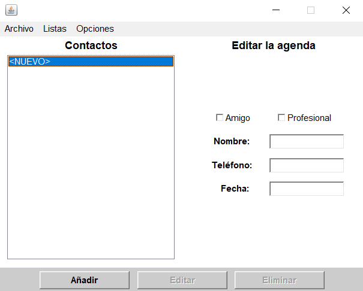
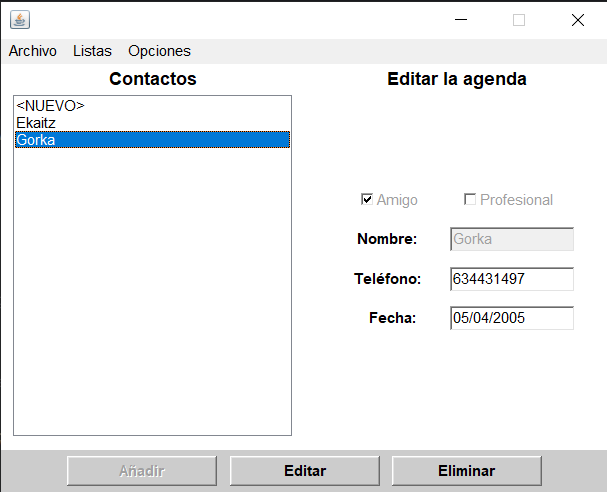
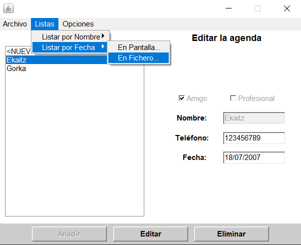
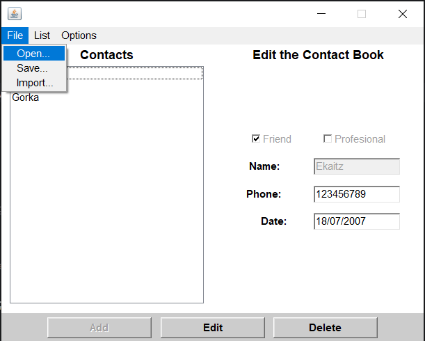

<h1 align="center">Agenda</h1>

El proyecto por excelencia de todos los programadores, y el primero que hice :)

<h2>📌 Descripción del proyecto</h2>

Una agenda que funciona como libro de contactos para guardar a tus amigos y conocidos profesionales, además de listarlos y exportarlos de diferentes formas

---

<h2>🛠️ Características principales</h2>

<ul>
  <li>Gestión de contactos</li>
  <li>Diferenciación entre amigos y profesionales</li>
  <li>Listados por diferentes etiquetas</li>
  <li>Herramientas para importar y exportar de diferentes ficheros</li>
  <li>CRUD básico de los contactos</li>
</ul>

---

<h2>🖥️ Capturas de la aplicación</h2>

<h3>Pantalla principal</h3>

<h3>Añadir contactos</h3>

<h3>Listados y demás ajustes</h3>

<h3>Edición y borrado</h3>

---

<h2>🚀 Tecnologías utilizadas</h2>

<ul>
  <li>Java</li>
  <li>AWT</li>
  <li>SQLDeveloper</li>
  <li>Oracle</li>
</ul>

---

<h2>📌 Notas adicionales</h2>

Mi proyecto más antiguo, cuando aún estaba conociendo y aprendiendo los fundamentos de Java

